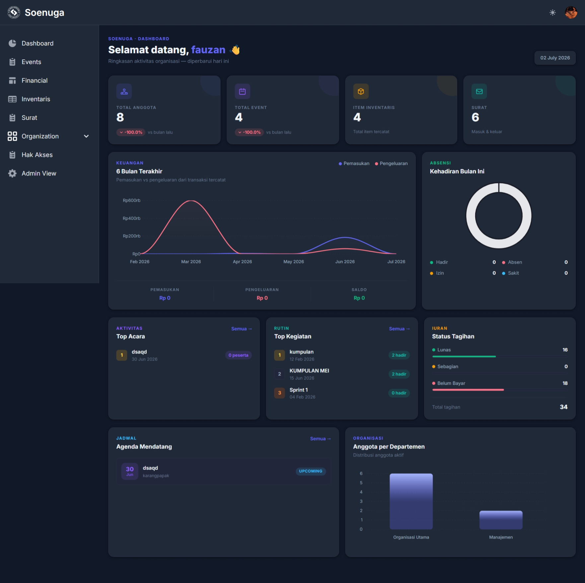

# SOENUGA — Sistem Manajemen Organisasi Himpunan Mahasiswa


**SOENUGA** (Software Engineering Universitas Garut) adalah aplikasi manajemen organisasi berbasis web yang dikembangkan untuk membantu Himpunan Mahasiswa SOENUGA, Program Studi Rekayasa Perangkat Lunak, Universitas Garut, dalam mengelola administrasi organisasi secara terpusat dan terintegrasi.

Sebelumnya pengelolaan anggota, keuangan, inventaris, kegiatan, dan surat-menyurat organisasi masih dilakukan secara manual dan tersebar di berbagai platform (WhatsApp, Google Drive, Excel). SOENUGA hadir sebagai satu platform terintegrasi untuk menggantikan proses tersebut.

Proyek ini merupakan implementasi dari skripsi **"Rancang Bangun Sistem Manajemen Organisasi Himpunan Mahasiswa Menggunakan *Framework* Django dan Metode *Extreme Programming* (XP)"**.

## Fitur Utama

- **Autentikasi & Manajemen Pengguna** — login, register, profil anggota, upload foto profil, ubah kata sandi.
- **Struktur Organisasi** — pengelolaan unit organisasi (departemen/divisi), keanggotaan (*membership*), serta *role* & hak akses berbasis *group/permission* Django dengan cakupan (*scope*) global, unit, departemen, atau diri sendiri.
- **Kegiatan & Acara** — pencatatan acara/kegiatan, status pelaksanaan (*upcoming*, *ongoing*, *completed*, *cancelled*), panitia acara, serta absensi peserta kegiatan.
- **Keuangan** — pengelolaan jenis iuran/kas, periode tagihan, serta pencatatan transaksi terhadap peserta kegiatan.
- **Inventaris** — pencatatan aset dan barang habis pakai, termasuk jumlah masuk, terpakai, rusak, dan sisa stok, lengkap dengan dokumentasi foto barang.
- **Surat Menyurat** — arsip surat masuk dan keluar beserta berkas lampiran.
- **Dashboard** — ringkasan data organisasi (jumlah anggota, keuangan, kegiatan, inventaris, surat) secara *real-time*.

## Tampilan

**Dashboard Sistem** — menampilkan ringkasan anggota, keuangan, inventaris, kehadiran, serta agenda kegiatan secara *real-time*.



## Tech Stack

| Layer | Teknologi |
|---|---|
| Backend | Python, [Django](https://www.djangoproject.com/) 5.2 (arsitektur MVT) |
| Database | MySQL |
| Frontend | HTML, CSS, JavaScript, Django Template Language, Tailwind CSS (Flowbite), ApexCharts |
| Autentikasi | Django `AbstractUser` custom (`users.User`) |

## Struktur Proyek

Struktur proyek disusun secara modular berdasarkan domain fungsional bisnis (*domain partitioning*), setiap domain merupakan satu Django *app* yang berdiri sendiri:

```
Soenuga/
├── Soenuga/            # Konfigurasi utama proyek (settings, urls, wsgi/asgi)
├── users/              # Autentikasi, akun & profil pengguna
├── organization/       # Struktur organisasi, unit, role & hak akses, keanggotaan
├── activity/           # Kegiatan/acara organisasi & peserta
├── finance/            # Keuangan, iuran/kas, tagihan
├── inventory/          # Inventaris & aset organisasi
├── correspondence/     # Surat masuk & keluar
├── templates/          # Template HTML per modul
├── static/             # Aset statis (CSS, JS, gambar, dist Tailwind/Flowbite)
├── manage.py
└── db.sqlite3
```

## Instalasi & Menjalankan Secara Lokal

### 1. Prasyarat

- Python 3.11+ (disesuaikan dengan Django 5.2)
- MySQL Server (database aktif dan dapat diakses)
- `pip` dan `virtualenv`/`venv`

### 2. Clone repository

```bash
git clone https://github.com/FauzanFaiz17/Soenuga.git
cd Soenuga
```

### 3. Buat & aktifkan virtual environment

```bash
python -m venv venv
source venv/bin/activate        # Linux/Mac
venv\Scripts\activate           # Windows
```

### 4. Install dependencies

Proyek ini menggunakan Django dan *driver* MySQL. Install secara manual:

```bash
pip install django mysqlclient django-widget-tweaks
```


### 5. Siapkan database MySQL

Buat database baru sesuai konfigurasi pada `Soenuga/settings.py`:

```sql
CREATE DATABASE soenoeuga CHARACTER SET utf8mb4;
```

Secara default, aplikasi terhubung menggunakan konfigurasi berikut (`Soenuga/settings.py`):

```python
DATABASES = {
    'default': {
        'ENGINE': 'django.db.backends.mysql',
        'NAME': 'soenoeuga',
        'USER': 'root',
        'PASSWORD': '',
        'HOST': 'localhost',
        'PORT': '3306',
    }
}
```

Sesuaikan `USER`, `PASSWORD`, `HOST`, dan `PORT` dengan konfigurasi MySQL di perangkat Anda. Untuk penggunaan produksi, sebaiknya nilai-nilai ini dipindahkan ke *environment variable* (mis. dengan `python-decouple` atau `django-environ`) alih-alih ditulis langsung pada `settings.py`.

### 6. Jalankan migrasi database

```bash
python manage.py makemigrations
python manage.py migrate
```

### 7. Buat akun superuser (admin)

```bash
python manage.py createsuperuser
```

### 8. Jalankan server pengembangan

```bash
python manage.py runserver
```

Aplikasi dapat diakses melalui `http://127.0.0.1:8000/`, dan panel admin Django melalui `http://127.0.0.1:8000/admin/`.

## Autentikasi & Hak Akses

- Model pengguna kustom: `users.User` (`AUTH_USER_MODEL`).
- Login diarahkan ke halaman `signin` (`LOGIN_URL`), dan setelah berhasil login diarahkan ke `dashboard` (`LOGIN_REDIRECT_URL`).
- Hak akses (*role*) dikelola melalui model `Role` (proxy dari `Group` bawaan Django) dan `RolePermission`, dengan cakupan akses: `global`, `unit`, `department`, atau `self`.
- Status kepemimpinan unit organisasi (mis. Ketua Umum, Kepala Departemen, Kepala Divisi) memengaruhi kewenangan pengelolaan anggota lain melalui `Membership`.

## Pengujian

Pengujian fungsionalitas sistem dilakukan menggunakan metode **Black Box Testing** terhadap seluruh modul utama (autentikasi, anggota, kegiatan, keuangan, surat-menyurat, inventaris, hak akses, dan dashboard), serta **User Acceptance Testing (UAT)** kepada pengurus Himpunan Mahasiswa SOENUGA, dengan tingkat penerimaan pengguna mencapai 83% (kategori Sangat Baik).

## Cara Kontribusi

Proyek ini dikembangkan sebagai bagian dari tugas akhir (skripsi), namun tetap terbuka untuk kontribusi, laporan bug, maupun saran pengembangan lanjutan.

### Alur kontribusi

1. **Fork** repository ini ke akun GitHub Anda.
2. **Clone** hasil fork ke perangkat lokal:
   ```bash
   git clone https://github.com/<username-anda>/Soenuga.git
   cd Soenuga
   ```
3. Buat *branch* baru untuk perubahan Anda, gunakan penamaan yang deskriptif:
   ```bash
   git checkout -b fitur/nama-fitur
   # atau
   git checkout -b fix/nama-perbaikan
   ```
4. Ikuti langkah pada bagian [Instalasi & Menjalankan Secara Lokal](#instalasi--menjalankan-secara-lokal) untuk menyiapkan *environment* pengembangan.
5. Lakukan perubahan, lalu pastikan aplikasi tetap berjalan normal dan migrasi baru (jika ada) sudah dibuat:
   ```bash
   python manage.py makemigrations
   python manage.py migrate
   ```
6. *Commit* perubahan dengan pesan yang jelas:
   ```bash
   git add .
   git commit -m "feat: tambah fitur ekspor laporan keuangan"
   ```
7. *Push* branch ke fork Anda dan buka **Pull Request** ke branch `main` repository ini:
   ```bash
   git push origin fitur/nama-fitur
   ```
8. Jelaskan pada deskripsi *Pull Request*: latar belakang perubahan, apa yang diubah, dan cara mengujinya (sertakan tangkapan layar jika berupa perubahan tampilan).

### Panduan penulisan kode

- Ikuti struktur *domain partitioning* yang sudah ada — fitur baru sebaiknya ditempatkan pada *app* Django yang sesuai domainnya, atau dibuat sebagai *app* baru jika merupakan domain terpisah.
- Gunakan penamaan variabel, model, dan URL yang konsisten dengan konvensi yang sudah dipakai pada modul terkait.
- Sertakan/​perbarui *unit test* pada berkas `tests.py` di *app* yang bersangkutan bila memungkinkan.
- Untuk perubahan pada `models.py`, sertakan *migration* yang dihasilkan (`makemigrations`) dalam *commit* yang sama.

### Melaporkan bug atau mengajukan saran

Gunakan tab **Issues** pada repository untuk:
- Melaporkan bug (sertakan langkah reproduksi, *screenshot*, dan pesan error jika ada).
- Mengajukan usulan fitur baru atau perbaikan.

## Lisensi

Proyek ini dilisensikan di bawah [MIT License](LICENSE). Tambahkan berkas `LICENSE` pada root repository sesuai teks lisensi MIT apabila belum tersedia, agar badge lisensi pada README ini sesuai dengan kondisi repository.

## Penulis

**Fauzan Faiz Al-Ghifari**
Program Studi Rekayasa Perangkat Lunak, Fakultas Komunikasi dan Informasi, Universitas Garut
NPM: 24073122028
